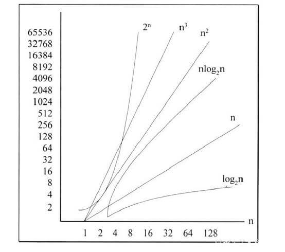

# 简单理解时间复杂度与空间复杂度

## 时间复杂度

- 大 O 表示法

1. 大 O 表示法可以知道运行时间如何随列表增长而增长
2. 大 O 表示法可以比较操作数，指出了算法运行时间的增速
3. O(n)中的 n，指的是操作数
4. 大 O 表示法指出了最糟糕情况下的运行时间

- 常见的大 O 运行时间

1. O(1) 常数时间
2. O(log n) 对数时间
3. O(n) 线性时间
4. O(n\*log n) 线性对数时间
5. O(n^2) 平方时间
6. O(n^3) 指数时间
7. O(2^n) 指数时间
8. O(n!)



- 算法速度

1. 算法的速度指的是操作数的增速，是随着输入的增加，运行时间将以什么样的速度增加
2. 算法的时间复杂度用大 O 表示法表示

- 画一个网格，包含 16 个格子，不同的算法下的时间复杂度（执行多少次操作）

1. 方法 1：每次画一个的方式画 16 个格子，复杂度是 O(n)
2. 方法 2：对折纸，一次对折相当于画两个格子，折 4 次就就得到了 16 个格子，复杂度是 O(log n)

- 常见的时间复杂度

```js
// 复杂度：O(n*1) = O(n)
for (var i = 0; i < 10; i++) {
  console.log(123);
}
```

```js
// 复杂度：O(log(2)(n)) = O(log n)
for (var i = 0; i < 10; i++) {
  i *= 2;
  console.log(123);
}
```

```js
// 复杂度：O(n*n*1) = O(n^2)
for (var i = 0; i < 10; i++) {
  for (var j = 0; j < 10; j++) {
    console.log(123);
  }
}
```

```js
// 复杂度：max(O(n^2), O(n)) = O(n^2)
for (var i = 0; i < 10; i++) {
  for (var j = 0; j < 10; j++) {
    console.log(123);
  }
}
for (var i = 0; i < 10; i++) {
  console.log(123);
}
```

```js
// 复杂度：max(O(n^2), O(n)) = O(n^2)
if (flag) {
  for (var i = 0; i < 10; i++) {
    for (var j = 0; j < 10; j++) {
      console.log(123);
    }
  }
} else {
  for (var i = 0; i < 10; i++) {
    console.log(123);
  }
}
```

```js
// T(0) = T(1) = 1，同时 T(n) = T(n - 1) + T(n - 2) + 1
// 当 n >= 1 时 T(n) < (5/3)^n，同时当 n > 4 时 T(n) >= (3/2)^n
// 复杂度：max((5/3)^n, (3/2)^n) = O(2^n)
function aFunc(n) {
  if (n <= 1) {
    return 1;
  } else {
    return aFunc(n - 1) + aFunc(n - 2);
  }
}
```

## 空间复杂度

1. 运行完一个程序时所需的内存大小
