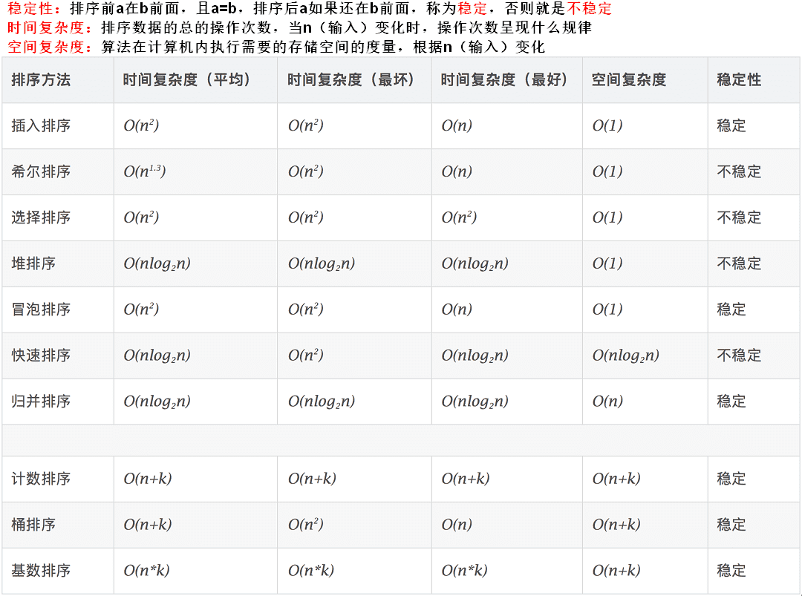

# 六大经典排序




```js
// 样本
var test1 = {
  arr1: [-1, 0, -11, -12, 12, 11, 4, 9, -1, 0],
  arr2: [-1, 0, -11, -12, 12, 11, 4, 9, -1, 0],
  arr3: [-1, 0, -11, -12, 12, 11, 4, 9, -1, 0],
  arr4: [-1, 0, -11, -12, 12, 11, 4, 9, -1, -99, 99, 100, 0],
  arr5: [-1, 0, -11, -12, 12, 11, 4, 9, -1, -99, 99, 100, 0],
  arr6: [-1, 0, -11, -12, 12, 11, 4, 9, -1, -99, 99, 100, 0]
};
```

## 冒泡排序

1. 比较两个元素，如果当前元素比下一个元素大，向上冒泡，循环一次后，最后一个数就是最大的数，依次重复，不循环已经排好序的数
2. 当一次循环没有发生冒泡，就代表排序完成，停止循环
3. 时间复杂度 O(n^2)

```js
function bubbleSort(arr) {
  var len = arr.length;
  for (var i = 0; i < len; i++) {
    let complete = true;
    for (var j = 0; j < len - 1 - i; j++) {
      if (arr[j] > arr[j + 1]) {
        [arr[j], arr[j + 1]] = [arr[j + 1], arr[j]];
        complete = false;
      }
    }
    if (complete) {
      break;
    }
  }
  return arr;
}
console.log(bubbleSort(test1.arr1));
```

## 插入排序

1. 把第一个元素看做是有序序列，把第二个到最后一个当作未排序序列
2. 从头到尾依次扫描未排序序列，比较扫描到的每个元素，比较大的元素，后移一位
3. 时间复杂度 O(n^2)

```js
function insertSort(arr) {
  var len = arr.length;
  for (var i = 1; i < len; i++) {
    var target = i;
    for (var j = i - 1; j >= 0; j--) {
      if (arr[target] < arr[j]) {
        [arr[target], arr[j]] = [arr[j], arr[target]];
        target = j;
      } else {
        break;
      }
    }
  }
  return arr;
}
console.log(bubbleSort(test1.arr2));
```

## 选择排序

1. 选择一个最小的元素放在序列起始位置，选择的这个元素称为已排序序列
2. 再从剩余的元素中中，放在已排序序列的队尾
3. 时间复杂度 O(n^2)

```js
function selectionSort(arr) {
  var len = arr.length;
  for (var i = 0; i < len; i++) {
    var minIndex = i;
    for (var j = i + 1; j < len; j++) {
      if (arr[j] < arr[minIndex]) {
        minIndex = j;
      }
    }
    [arr[i], arr[minIndex]] = [arr[minIndex], arr[i]];
  }
  return arr;
}
console.log(selectionSort(test1.arr3));
```

## 堆排序

1. 创建一个堆
2. 把堆首与堆尾互换，此时堆首是最大值
3. 缩小堆的尺寸，剩余元素调整为大顶堆
4. 复杂度 O(nlog n)

```js
function heapSort(arr) {
  var len = arr.length;
  buildMaxHeap(arr, len);
  for (i = len - 1; i > 0; i--) {
    [arr[0], arr[i]] = [arr[0], arr[i]];
    len--;
    heapify(arr, 0, len);
  }
  var buildMaxHeap = function(arr, len) {
    for (var i = Math.floor(len / 2); i >= 0; i--) {
      heapify(arr, i, len);
    }
  };
  // 第i个元素进行下沉，子节点比它大就下沉（把新数组顶端数据调到相应位置）
  var heapify = function(arr, i, len) {
    var left = 2 * i + 1;
    var right = 2 * i + 2;
    var largest = i;
    if (left < len && arr[left] > arr[largest]) {
      largest = left;
    }
    if (right < len && arr[right] > arr[largest]) {
      largest = right;
    }
    if (largest != i) {
      [arr[largest], arr[i]] = [arr[i], arr[largest]];
      heapify(arr, largest, len);
    }
  };
  return arr;
}
console.log(selectionSort(test1.arr4));
```

## 快速排序

1. 从数组中找出一个基准，重新排序，比基准小的在基准的左边，比基准大的，在基准的右边，这次循环之后，让基准处于中间位置，这个就叫分区
2. 递归的把小于基准的子数组和大于基准的子数据排序
3. 复杂度 O(logn)

```js
function quickSort(arr) {
  var sort = function(arr, left, right) {
    if (left < right) {
      var index = pivotest(arr, left, right);
      sort(arr, left, index - 1);
      sort(arr, index + 1, right);
    }
    return arr;
  };
  var pivotest = function(arr, left, right) {
    var pivot = left;
    var index = pivot + 1;
    for (var i = index; i <= right; i++) {
      if (arr[i] < arr[pivot]) {
        [arr[i], arr[index]] = [arr[index], arr[i]];
        index++;
      }
    }
    [arr[pivot], arr[index - 1]] = [arr[index - 1], arr[pivot]];
    return index - 1;
  };
  return sort(arr, 0, arr.length - 1);
}
console.log(quickSort(test1.arr5));
```

## 归并排序

1. 是分治法（将问题分成一个个小问题，治的阶段将结果“合并”）的典型应用
2. 将数组分割成若干个子序列，再使子序列有序，再让序列段有序，然后合并，其中两个有序列合并成一个有序列，称为二路合并
3. 分隔：在数组中点分隔，递归左右分别，直到数组长度小于 2
4. 合并：创建一个临时数组，比较两个数组的第一个元素，将小的 push 到 temp 中；如果两个数组其中有一个为空，说明另一个数组元素肯定大于 temp 中的元素，直接 push 到 temp 中
5. 复杂度:O(nlog n)

```js
function mergeSort(arr) {
  var sort = function(arr) {
    if (arr.length < 2) {
      return arr;
    }
    var mid = Math.floor(arr.length / 2);
    var left = arr.slice(0, mid);
    var right = arr.slice(mid);
    return merge(sort(left), sort(right));
  };
  var merge = function(left, right) {
    var temp = [];
    while (left.length > 0 && right.length > 0) {
      if (left[0] < right[0]) {
        temp.push(left.shift());
      } else {
        temp.push(right.shift());
      }
    }
    while (left.length > 0) {
      temp.push(left.shift());
    }
    while (right.length > 0) {
      temp.push(right.shift());
    }
    return temp;
  };
  return sort(arr);
}
console.log(mergeSort(test1.arr6));
```
