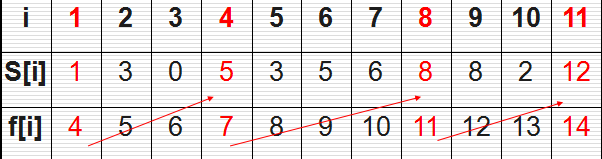

# 贪心算法

## 基本概念

1. 不从整体最优上考虑，只做局部最优解
2. 贪心算法不是对所有问题都能得到整体最优解
3. 贪心算法无后效性，某个状态以后的过程不会影响以前的状态，只与当前状态有关

## 基本思路

1. 建立数学模型描述问题
2. 把求解问题分成若干个子问题
3. 对每一个子问题求解，得到子问题的局部最优解
4. 把子问题的局部最优解合成原来问题的一个解

## 适用场景

## 实现思路

## 具体使用

1. 活动选择问题

   > 有 n 个需要在同一天使用同一个教室的活动 a1,a2,...an，教室同一时刻只能由一个活动使用，每个活动 ai 都有一个开始时间 start[i]与 end[i],一旦被选则后，教室就被占据了，这个时间段就不能上其他活动，`需要选择尽量多的活动而不冲突`，按照数学归纳法，**每次选择结束最早的活动，最终可以选到最多的活动**

   

   ```js
   function getMaxCas(start, end) {
     var pre = 0;
     var result = [];
     for (i = 1; i < start.length; i++) {
       if (i === 1) result.push([start[i - 1], end[i - 1]]);
       if (start[i] >= end[pre]) {
         pre = i;
         result.push([start[i], end[i]]);
       }
     }
     return result;
   }
   let start = [1, 3, 0, 5, 3, 5, 6, 8, 8, 2, 12];
   let end = [4, 5, 6, 7, 8, 9, 10, 11, 12, 13, 14];
   console.log(getMaxCas(start, end));
   // [ [ 1, 4 ], [ 5, 7 ], [ 8, 11 ], [ 12, 14 ] ]
   
   ```

2. 钱币找零问题
   > 假设有 1, 2, 5, 10, 20, 50, 100 各若干张纸币，`问用这些钱支付K元，至少需要多少张`，**每次尽可能用最大的纸币，最终选择的纸币就会是最少的**
   ```js
   function solve(obj, val, money) {
     var count = 0;
     var arr = [];
     while (money > 0) {
       for (var i = val.length - 1; i >= 0; i--) {
         // 每次都从面值最大开始选择，直到money小于0
         if (val[i] <= money) {
           money -= val[i];
           count++;
           obj[val[i]]++;
           arr.push(val[i]);
           break;
         }
       }
     }
     console.log("最少需要", count, "张纸币");
     console.log("分别是：");
     for (var key in obj) {
       if (obj[key]) {
         console.log(key, "元需要", obj[key] + "张");
       }
     }
   }
   var obj = {
     1: 0,
     2: 0,
     5: 0,
     10: 0,
     20: 0,
     50: 0,
     100: 0
   };
   var val = [1, 2, 5, 10, 20, 50, 100];
   solve(obj, val, 124);
   // 最少需要 4 张纸币
   // 分别是：
   // 2 元需要 2张
   // 20 元需要 1张
   // 100 元需要 1张
   ```
3. 背包问题
4. 多机调度问题
5. 小船过河问题
6. 区间覆盖问题
7. 销售比赛
8. Huffman 编码
9. Dijkstra 算法
10. 最小生成树算法
