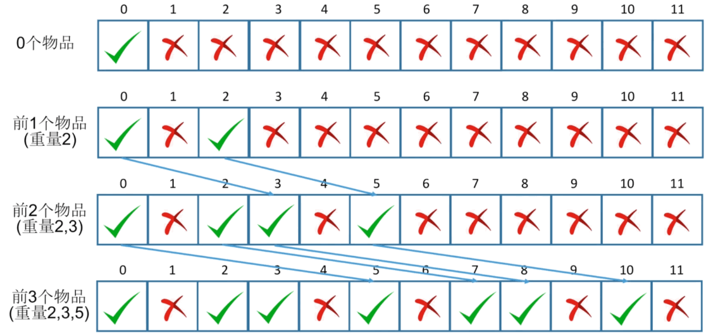

# 背包型动态规划

1. 背包有最大承重、往背包放的物品有重量和价值
2. 可问：不撑爆背包的前提下，1、装下最多重量物品；2、装下最大总价值物品；3、有多少种方式正好带走满满一书包物品，等等
3. 逐个放入物品，看是否还能放入，关键点：`还有几个物品`，`还剩多少承重`
4. 背包问题中，开的是否能承重数组大小和总承重有关

## 背包问题总结

> 背包问题，一定要把总承重放入状态中，同时最优解的打印，可以用`pi`方式解决，如果所有结果的打印就得用`递归`

- 题 1：

1. 是`可行性背包`，最多装多少重量，记录前 i 个物品能不能拼出重量
2. 是`0-1背包`:有 n 种重量和价值分别为 Wi 和 Vi 的物品。从这些物品中挑选出总重量不超过 w 的物品，每种物品都`只能挑选一件`，求所有挑选方案中价值总和的最大值

- 题 2

1. 是`计数型背包`，记录前 i 个物品有多少种方式拼出重量 W
2. 同时也是`0-1背包`

- 题 3

1. 是`计数型背包`，记录有多少种方式拼出重量 W
2. 是`完全背包`：有 n 种重量和价值分别为 Wi 和 Vi 的物品。从这些物品中挑选出总重量不超过 w 的物品，每种物品都`可以挑选多件`，求所有挑选方案中价值总和的最大值
3. 完全背包和 0-1 背包的区别：如果物品没有顺序（可以挑多件），就看最后一个物品是谁；如果有顺序，判断有顺序的 A[N]有没有进。因为没顺序要挑一个，有顺序最后一个要么进要么没进，然后再到倒数第 2 个

- 题 4

1. 不超过载重，并且价值还最大，是真正意义的 0-1 背包：`有 n 种重量和价值分别为 Wi 和 Vi 的物品。从这些物品中挑选出总重量不超过 w 的物品，每种物品都只能挑选一件，求所有挑选方案中价值总和的最大值`

## 背包型动态规划的使用

1. **是否可以装入**

- 给定 N 个物品，重量分别是正整数 A0,...,A(N-1)
- 一个背包最大承重是正整数 M
- 问：`做多能带走多重物品`
- 如:[2,3,5,7] 最大承重 11，最大带走 2，3，5，一共是 10

- 确定状态

  1. 需要知道 N 个物品是否能拼出重量 W（0~M，最后一步：最后一个物品（重量 A(N-1)）是否进入背包。情况 1：如果前 N-1 个物品能拼出 W，当然前 N 个物品也能拼出 W。情况 2：如果前 N-1 个物品能拼出 W-A(N-1)，再加上最后一个物品就能拼出 W
  2. 例如，4 个物品，重量为 2，3，5，7
  3. 前 3 个物品可以拼出重量 8(3+5)，自然前 4 个物品也可以拼出 8
  4. 前 3 个物品可以拼出重量 2，加上最后一个物品，就可以拼出重量 9

  - `错误的状态`

  1. f[i]表示前 i 个物品拼出的最大重量，比如[3,9,5,2]，最大重量 10
  2. 前 j 个物品拼出的最大重量是 9（j<i），加上最后一个 2，是 11，撑爆背包，如果直接用 9，就不是最优策略
  3. 最优策略是选择前前 j 个物品拼出的重量 3+5=8（j<i），加上最后一个 2，结果是 10，但是 8 不是前 j 个总重量最大的，不满足前 i 个物品拼的最大重量，却算出了最优的结果
  4. 错误原因：`背包问题的重点：不超过一个数的前提下，前j个拼起来最大加最后一个数，不一定是不超过Target的最大重量`

  - `正确的状态`

  1. 设 f[i][w] = 能否用前 i 个物品拼出重量 w(true/false)，其中(0<=w<=M)

- 转义方程
  1. f[i][w] = f[i-1][w] OR f[i-1]w-A[i-1]] f[i-1][w]:能否用前 i-1 个物品拼出重量 w；f[i-1][w-a(i-1)]能否用 i-1 个物品拼出重量 w-A(i-1)，再加上第 i 个物品
- 初始条件与边缘情况
  1. f[0][0] = true
  2. f[0][1...m] = false
  3. 边界情况:数组下标非负数，f[i-1][w-a(i-1)]中的 w>=A(i-1)
- 计算顺序
  1. f[0][1]...f[0][m]
  2. f[1][0]...f[1][m]
  3. ...
  4. f[N][0]...f[N][m]

```js
function twoDimensionArr(m, n, val = undefined) {
  var arr = [];
  for (var i = 0; i < m; i++) {
    var col = [];
    for (var j = 0; j < n; j++) {
      col[j] = val;
    }
    arr[i] = col;
  }
  return arr;
}
function backPack(n, arr) {
  var m = arr.length;
  if (m === 0) {
    return 0;
  }
  var f = twoDimensionArr(m + 1, n + 1);
  // 初始化：前0个物品拼出重量0
  f[0][0] = true;
  for (var i = 1; i <= n; i++) {
    // 前0个物品拼出重量1...n
    f[0][i] = false;
  }
  for (var i = 1; i <= m; i++) {
    for (var j = 0; j <= n; j++) {
      // 前i-1个物品拼出重量j
      f[i][j] = f[i - 1][j];
      // 边缘情况，j要大于等于arr[i-1]，如果j=11,最后一个是10000，那么最后一个不算，就在前i-1个物品拼重量j
      if (j >= arr[i - 1]) {
        // 前i-1个物品拼出重量j-arr[i-1]，再加上第i个物品
        f[i][j] |= f[i - 1][j - arr[i - 1]];
      }
    }
  }
  var res = 0;
  // 先把0-n的重量都枚举出来，为true的就是拼的最大重量
  for (var i = n; i >= 0; i--) {
    // 其中第0...n个中，从右往左，第i个位true的就是最大重量
    if (f[m][i]) {
      res = i;
      break;
    }
  }
  return res;
}
var test = [2, 3, 5, 7];
console.log(backPack(11, test));
// 10
```



```js
// 打印路径，打印最优解的路径可以用pi解决
// 但是打印所有路径就得用递归了
function backPack_2(n, arr) {
  var m = arr.length;
  if (m === 0) {
    return 0;
  }
  var f = twoDimensionArr(m + 1, n + 1);
  // pi
  var pi = twoDimensionArr(m + 1, n + 1);
  f[0][0] = true;
  for (var i = 1; i <= n; i++) {
    f[0][i] = false;
  }
  for (var i = 1; i <= m; i++) {
    for (var j = 0; j <= n; j++) {
      f[i][j] = f[i - 1][j];
      // 打印路径
      pi[i][j] = 0;
      if (j >= arr[i - 1]) {
        // 打印路径
        if (f[i - 1][j - arr[i - 1]]) {
          pi[i][j] = 1;
        }
        // 动态规划
        f[i][j] |= f[i - 1][j - arr[i - 1]];
      }
    }
  }
  var res;
  for (var i = n; i >= 0; i--) {
    if (f[m][i]) {
      res = i;
      break;
    }
  }
  // 打印路径
  var i = res;
  var sub = [];
  for (var j = m; j >= 0; j--) {
    if (pi[j][i]) {
      sub.push(arr[j - 1]);
      i -= arr[j - 1];
    }
  }
  // 打印路径
  console.log(reverse(sub).toString());
  return res;
}
var test2 = [2, 3, 5, 7];
console.log(backPack_2(10, test2));
```

2. **0-1 背包，组合多少个**

- 给定一个数组  candidates  和一个目标数  target ，
- 问:`一共有多少个组合`
- candidates 中的每个数字在每个组合中只能使用一次
- 1. 所有数字（包括目标数）都是正整数 2. 解集可以包含重复的组合
- 例子：[1,2,3,3,7],8=>[1,7] || [2,3,3]
- 转换为背包问题：`数字的和加起来就是一个给定数，数字可以是物品重量，数字的和为背包载重`
- 转换为 0-1 背包：`0-1背包时能否，而此题是问有多少种方式，使用加法原理，无重复，无遗漏，上道题的情况1+上道题的情况2=result`
- 确定状态：f[i][w]第 i 个物品有多少种方式拼成 w
- 转义方程：f[i][w] =f[i-1][w] + f[i-1]w-A[i-1]]，把上题的 or 换成+
- 初始情况与边缘条件与上题一样
  1. f[0][0] = 1 0 个物品可以有 1 种方式拼出重量 0
  2. f[0][1]...f[0][w] = 0 0 个物品可以有 0 种方式拼出重量 1...W
  3. 边缘条件：w>=A[i-1]
- 计算顺序
  1. f[0][0],...,f[0][w]
  2. f[1][0],...,f[1][n]
  3. ...
  4. f[N][0],...,f[N][n]

```js
// 时间复杂度O(nw),空间复杂度O(nw)
function twoDimensionArr(m, n, val = undefined) {
  var arr = [];
  for (var i = 0; i < m; i++) {
    var col = [];
    for (var j = 0; j < n; j++) {
      col[j] = val;
    }
    arr[i] = col;
  }
  return arr;
}
function backpack(n, arr) {
  var m = arr.length;
  if (m === 0) {
    return 0;
  }
  var f = twoDimensionArr(m + 1, n + 1, 0);
  f[0][0] = 1;
  for (var i = 1; i <= n; i++) {
    f[0][1] = 0;
  }
  for (var i = 1; i <= m; i++) {
    for (var j = 0; j <= n; j++) {
      f[i][j] = f[i - 1][j];
      if (j >= arr[i - 1]) {
        f[i][j] += f[i - 1][j - arr[i - 1]];
      }
    }
  }
  return f[m][n];
}
var test = [1, 2, 3, 3, 7];
console.log(backpack(8, test));
// 2
```

```js
// 滚动数组：时间复杂度O(nw),空间复杂度O(w)
function backpack2(n, arr) {
  var m = arr.length;
  if (m === 0) {
    return 0;
  }
  var f = twoDimensionArr(2, n + 1);
  var old = 0;
  var now = 0;
  f[0][0] = 1;
  for (var i = 1; i <= n; i++) {
    f[0][i] = 0;
  }
  for (var i = 1; i <= m; i++) {
    old = now;
    now = 1 - now;
    for (var j = 0; j <= n; j++) {
      f[now][j] = f[old][j];
      if (j >= arr[i - 1]) {
        f[now][j] += f[old][j - arr[i - 1]];
      }
    }
  }
  return f[now][n];
}
console.log(backpack2(8, test));
// 2
```

```js
// 空间优化
// 原空间复杂度0(NW) ----滚动数组（两行）->O(W)--倒着更新覆盖（一行）-->0(W)
// 如何倒着：按照f[i][W],...f[i][0],每次倒着用新计算的结果的覆盖老的接口，只用1行
// 时间复杂度O(NW) 滚动数组压缩成一行 空间复杂度O(W)
function backpack3(n, arr) {
  var m = arr.length;
  if (m === 0) {
    return 0;
  }
  var f = new Array(n + 1);
  f[0] = 1;
  // f[0][0] = 1 f[0][1...n]=0
  for (var i = 1; i <= n; i++) {
    f[i] = 0;
  }
  for (var i = 1; i <= m; i++) {
    // reserve order
    for (var j = n; j >= 0; j--) {
      if (j >= arr[i - 1]) {
        // old+old=>now
        f[j] += f[j - arr[i - 1]];
      }
    }
  }
  return f[n];
}
console.log(backpack3(8, test));
// 2
```

3. **组合总和 Ⅳ(leetcode 377)**

- 给定一个由正整数组成且不存在重复数字的数组，
- 问：`找出和为给定目标正整数的组合的个数`
- 如：[1,2,4],4=>([1,1,1,1]、[2,2]、[1,1,2]、[1,2,1],[2,1,1],[4])=>6 种
- 区别：组合中的数字可以按不同顺序，比如 1，1，2 与 1，2，1 算两种组合；不能先处理第一个物品，再处理第 2 个物品
- 关注点：`最后一个物品的重量是多少`
- 关键点 1：`任何一个正确的组合中，所有物品总重量是Target`
- 关键点 2：`如果最后一个物品重量是K，则前面的物品重量为Target-K`；
- 确定状态
  1. 设 f[i] = 有多少种组合能拼出重量 i
- 转义方程
  1. f[i] = f[i-A[0]] + f[i-A[1]] +...+f[i-A[n-1]]
- 初始条件与边缘情况
  1. f[0] = 1
  2. [1,2,4]=>f[3] = f[3-A[0]] + f[3-A[1]] = i>=A[j]
- 计算顺序
  1. 从左到右

```js
// 动态规划
function backPack(n, arr) {
  var arr = arr;
  var m = arr.length;
  if (m === 0) {
    return 0;
  }
  var f = new Array(n + 1);
  f[0] = 1;
  for (var i = 1; i <= n; i++) {
    f[i] = 0;
    for (var j = 0; j < m; j++) {
      if (i >= arr[j]) {
        f[i] += f[i - arr[j]];
      }
    }
  }
  return f[n];
}
var test = [1, 2, 4];
console.log(backPack(4, test));
// 6
```

```js
// 递归做法
function backPack_2(n, arr) {
  if (n === 0) {
    return 1;
  }
  var res = 0;
  for (var i = 0; i <= arr.length; i++) {
    if (n >= arr[i]) {
      res += backPack_2(n - arr[i], arr);
    }
  }
  return res;
}
console.log(backPack_2(4, test));
// 6
```

4. **取最大价值**

- 给定 N 个物品，重量分别是正整数 A[0]...A[N-1]，价值分别为正整数 V[0]...V[N-1]，一个背包的最大承重是 M，每个物品只能拿一次
- 问：`最多带走多大价值的物品`
- 如 重量[2,3,5,7]，对应价值[1,5,2,4]，最大承重 11，选择[3,7]=>[5,4]，第 2 个和第 4 个，总价值为 9，重量不超过 11
- 第 2 题中，对于每个总重量，我们如果都知道能不能装，就可以找出最重并且不超过背包载重的组合
- 这题中，对于每个总重量，我们能知道对应的最大价值是多少，就可以找出答案
- 这题不关心有没有最大程度不超过载重，而是关系不超过载重但价值最大，这个不一定是最大程度不超过载重

- 确定状态
  1. 最后一步：最后一个物品（重量 A[N-1]，价值 V[N-1]）是否能进入背包
  2. 子问题：原来是要求前 N 个物品能不能拼出重量 0，1，...M，以及拼出重量 W 能不能获得最大价值，现在转成前 N-1 个可以可以
  3. 状态：f[i][w] = 前 i 个物品拼出重量 W 时的最大价值，其中-1 表示不能拼出 w
- 转义方程
  1. f[i][w] = max{f[i-1][w],f[i-1]w-A[i-1]]+V[i-1]} 其中 w>=A[i-1] && f[i-1]w-A[i-1]]!==-1
  - 初始情况与边缘条件
  2. f[0][0] = 0
  3. f[0][0...m] = -1
  4. 边缘条件：w>=A[i-1] && f[i-1]w-A[i-1]]!==-1
- 计算顺序
  1. f[0][0]...f[0][m]
  2. f[1][0]...f[1][m]
  3. ...
  4. f[N][0]...f[N][m]
- 结果(因为不是 F[N][m]，在 f 数组中，找出最大值的，这个不一定是最后一个)
  1. max{f[N][j]} 其中 0<=j<=M && f[N][j]!==-1

```js
// 空间复杂度O(NW)
function twoDimensionArr(m, n, val) {
  var arr = [];
  for (var i = 0; i < m; i++) {
    var col = [];
    for (var j = 0; j < n; j++) {
      col[j] = val;
    }
    arr[i] = col;
  }
  return arr;
}
function backpack(n, w, v) {
  var m = w.length;
  if (m === 0) {
    return 0;
  }
  // 二维数组
  var f = twoDimensionArr(m + 1, n + 1, 0);
  // 初始条件
  f[0][0] = 0;
  for (var i = 1; i <= n; i++) {
    f[0][i] = -1;
  }
  // 计算最大价值
  for (var i = 1; i <= m; i++) {
    for (var j = 0; j <= n; j++) {
      f[i][j] = f[i - 1][j];
      if (j >= w[i - 1] && f[i - 1][j - w[i - 1]] !== -1) {
        f[i][j] = Math.max(f[i][j], f[i - 1][j - w[i - 1]] + v[i - 1]);
      }
    }
  }
  // 获取最大价值
  var res = 0;
  for (var i = 0; i <= n; i++) {
    if (f[m][i] !== -1) {
      res = Math.max(res, f[m][i]);
    }
  }
  return res;
}
var w = [2, 3, 5, 7];
var v = [1, 5, 2, 4];
console.log(backpack(11, w, v));
// 9
```

```js
// 空间复杂度O(W)
// 滚动数组
function backpack_2(n, w, v) {
  var m = w.length;
  if (m === 0) {
    return 0;
  }
  // 二维数组
  var f = twoDimensionArr(2, n + 1, 0);
  // 初始条件
  var old,
    now = 0;
  f[0][0] = 0;
  for (var i = 1; i <= n; i++) {
    f[0][i] = -1;
  }
  // 计算最大值
  for (var i = 1; i <= m; i++) {
    old = now;
    now = 1 - now;
    for (var j = 0; j <= n; j++) {
      f[now][j] = f[old][j];
      if (j >= w[i - 1] && f[old][j - w[i - 1]] !== -1) {
        f[now][j] = Math.max(f[now][j], f[old][j - w[i - 1]] + v[i - 1]);
      }
    }
  }
  // 获取最大值
  var res = 0;
  for (var i = 0; i <= n; i++) {
    if (f[now][i] !== -1) {
      res = Math.max(res, f[now][i]);
    }
  }
  return res;
}
console.log(backpack_2(11, w, v));
// 9
```
