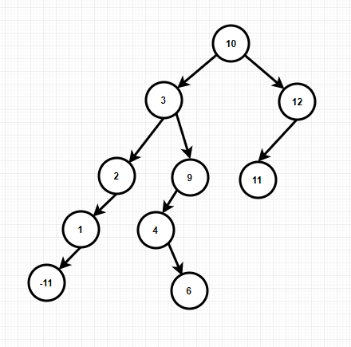

# 树

## 树是什么

1. 树是一种非线性数据结构
2. 树用来存储有层级关系的数据，一棵树有根节点、父节点、叶子节点，树的层数就是树的深度

## 树的种类

- **二叉树**

1. 二叉树是一种特殊的树，子节点不超过两个
2. 二叉树查找、添加、删除很快
3. 二叉树第 i 层节点最多为 2^(i-1) (i>=1)，高度为 k 的二叉树，其节点总数最多为 2^k-1 (k>=1)

- **满二叉树**

1. 深度为 k，且有 2^k-1 (k>=1)个节点的树

- **完全二叉树**

1. 深度为 k，有 n 个节点的二叉树，当且仅当其每个节点都与深度为 k 的满二叉树中编号从 1 至 n 的节点一一对应（除最后一层外，每一层上的节点数均达到最大值，最后一层上只缺少右边的若干节点），其深度为 log2n+1

- **二叉树找树 (BST)（又称二叉排序树、二叉搜索树）**

1. 二叉树找树（BST）是一种特殊的二叉树，相对较小的值保存在左节点，相对较大的值保存在由节点
2. 没有键值相等的节点、左右子树分别为 BST
3. BST 的找树，1)前序：`先访问根节点，然后以升序的方式访问左子树与右子树（根左右）`；2)中序：`按照节点上的键值，以升序方式，访问BST上所有的节点（左根右）`；3)后序：`先访问子叶节点，从左子树到右子树，再到根节点（左右根）`

   ***

   ```js
   function Node(data, left, right) {
     this.data = data;
     this.left = left;
     this.right = right;
     this.show = show;
   }
   var show = function() {
     return this.data;
   };
   function BST() {
     this.root = null;
     this.insert = insert;
     this.inOrder = inOrder;
     this.preOrder = preOrder;
     this.postOrder = postOrder;
     this.getMin = getMin;
     this.getMax = getMax;
     this.find = find;
   }
   var insert = function(data) {
     var n = new Node(data, null, null);
     if (!this.root) {
       this.root = n;
     } else {
       var current = this.root;
       var parent;
       while (1) {
         parent = current;
         if (data < current.data) {
           current = current.left;
           if (!current) {
             parent.left = n;
             break;
           }
         } else {
           current = current.right;
           if (!current) {
             parent.right = n;
             break;
           }
         }
       }
     }
   };
   var arr1 = [];
   var arr2 = [];
   var arr3 = [];
   // 前序
   var preOrder = function(node) {
     if (node) {
       arr1.push(node.show());
       preOrder(node.left);
       preOrder(node.right);
     }
   };
   // 中序
   var inOrder = function(node) {
     if (node) {
       inOrder(node.left);
       arr2.push(node.show());
       inOrder(node.right);
     }
   };
   // 后序
   var postOrder = function(node) {
     if (node) {
       postOrder(node.left);
       postOrder(node.right);
       arr3.push(node.show());
     }
   };
   // 查找最小值
   var getMin = function() {
     var current = this.root;
     while (current.left) {
       current = current.left;
     }
     return current;
   };
   // 查找最大值
   var getMax = function() {
     var current = this.root;
     while (current.right) {
       current = current.right;
     }
     return current;
   };
   // 查找指定值
   var find = function(data) {
     var current = this.root;
     while (current) {
       if (data === current.data) {
         return current;
       } else if (data < current.data) {
         current = current.left;
       } else {
         current = current.right;
       }
     }
     return null;
   };
   var bst = new BST();
   bst.insert(10);
   bst.insert(3);
   bst.insert(2);
   bst.insert(9);
   bst.insert(4);
   bst.insert(12);
   bst.insert(6);
   bst.insert(1);
   bst.insert(11);
   bst.insert(-11);
   bst.preOrder(bst.root);
   bst.inOrder(bst.root);
   bst.postOrder(bst.root);
   console.log(arr1);
   console.log(arr2);
   console.log(arr3);
   // 前序：[ 10, 3, 2, 1, -11, 9, 4, 6, 12, 11 ]
   // 中序：[ -11, 1, 2, 3, 4, 6, 9, 10, 11, 12 ]
   // 后序：[ -11, 1, 2, 6, 4, 9, 3, 11, 12, 10 ]
   console.log(bst.getMin().data);
   console.log(bst.getMax().data);
   console.log(bst.find(9).data);
   // -11
   // 12
   // 9
   ```

   由前序和中序可得树结构为

   

   ***

   BST 删除节点

   1. 叶子节点：改变父节点的指向为 null
   2. 只包含一个子节点：该节点（它）的父节点，指向它的子节点
   3. 包含两个子节点：1）寻找右子树的最小子节点，创建临时节点；2）复制临时节点到待删除节点；3）删除临时节点。

   ```js
   function Node(data, left, right) {
     this.data = data;
     this.left = left;
     this.right = right;
     this.show = show;
   }
   var show = function() {
     return this.data;
   };
   function BST() {
     this.root = null;
     this.insert = insert;
     this.inOrder = inOrder;
     this.deleteNode = deleteNode;
   }
   var insert = function(data) {
     var n = new Node(data, null, null);
     if (!this.root) {
       this.root = n;
     } else {
       var current = this.root;
       var parent;
       while (1) {
         parent = current;
         if (data < current.data) {
           current = current.left;
           if (!current) {
             parent.left = n;
             break;
           }
         } else {
           current = current.right;
           if (!current) {
             parent.right = n;
             break;
           }
         }
       }
     }
   };
   var arr2 = [];
   // 中序
   var inOrder = function(node) {
     if (node) {
       inOrder(node.left);
       arr2.push(node.show());
       inOrder(node.right);
     }
   };
   // 寻找右子树的最小节点
   var rightMin = function(node) {
     if (!node.left) {
       return node;
     }
     return rightMin(node.left);
   };
   var deleteNode = function(root, data) {
     if (!root) {
       return null;
     }
     if (data === root.data) {
       if (!root.left && !root.right) {
         return null;
       } else if (!root.left) {
         return root.right;
       } else if (!root.right) {
         return root.left;
       } else {
         var temp = rightMin(root.right);
         root.data = temp.data;
         root.right = deleteNode(root.right, temp.data);
         return root;
       }
     } else if (data < root.data) {
       root.left = deleteNode(root.left, data);
       return root;
     } else {
       root.right = deleteNode(root.right, data);
       return root;
     }
   };

   var bst = new BST();
   bst.insert(10);
   bst.insert(3);
   bst.insert(2);
   bst.insert(9);
   bst.insert(4);
   bst.insert(12);
   bst.insert(6);
   bst.insert(1);
   bst.insert(11);
   bst.insert(-11);
   // 删除有两个子节点的节点
   bst.deleteNode(bst.root, 3);
   bst.inOrder(bst.root);
   console.log(arr2);
   // 原树：[ -11, 1, 2, 3, 4, 6, 9, 10, 11, 12 ]
   // 删除后的树：[ -11, 1, 2, 4, 6, 9, 10, 11, 12 ]
   ```

   ***

   计数：统计重复节点出现的次数

   ```js
   function Node(data, left, right) {
     this.data = data;
     this.left = left;
     this.right = right;
     this.show = show;
     this.count = 1;
   }
   var show = function() {
     return this.data;
   };
   function BST() {
     this.root = null;
     this.insert = insert;
     this.inOrder = inOrder;
     this.update = update;
     this.find = find;
   }
   var insert = function(data) {
     var n = new Node(data, null, null);
     if (!this.root) {
       this.root = n;
     } else {
       var current = this.root;
       var parent;
       while (1) {
         parent = current;
         if (data < current.data) {
           current = current.left;
           if (!current) {
             parent.left = n;
             break;
           }
         } else {
           current = current.right;
           if (!current) {
             parent.right = n;
             break;
           }
         }
       }
     }
   };
   var arr2 = [];
   // 中序
   var inOrder = function(node) {
     if (node) {
       inOrder(node.left);
       arr2.push(node.show());
       inOrder(node.right);
     }
   };
   // 查找指定值
   var find = function(data) {
     var current = this.root;
     while (current) {
       if (data === current.data) {
         return current;
       } else if (data < current.data) {
         current = current.left;
       } else {
         current = current.right;
       }
     }
     return null;
   };
   var update = function(data) {
     var temp = this.find(data);
     temp.count++;
     return temp;
   };
   var bst = new BST();
   var grade = [10, 3, 2, 9, 4, 12, 6, 1, 11, -11, 4, 4];
   for (var i = 0; i < grade.length; i++) {
     var temp = bst.find(grade[i]);
     if (!temp) {
       bst.insert(grade[i]);
     } else {
       bst.update(grade[i]);
     }
   }
   bst.inOrder(bst.root);
   console.log(arr2);
   console.log(bst.find(4).count);
   // [ -11, 1, 2, 3, 4, 6, 9, 10, 11, 12 ]
   // 3
   ```

- **堆**

- **哈弗曼树**

- **平衡二叉树**

- **B，B+，B\*树**

- **Trie 树**

- **红黑树**

- **LSM 树**
